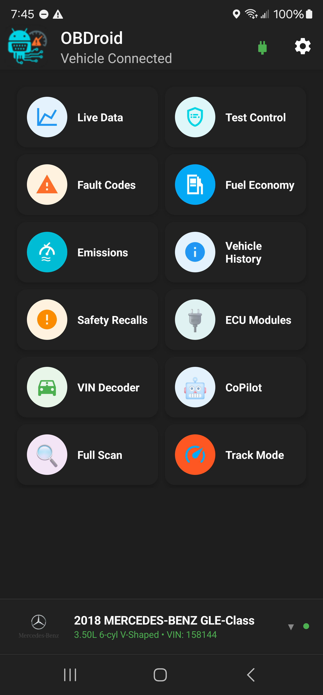
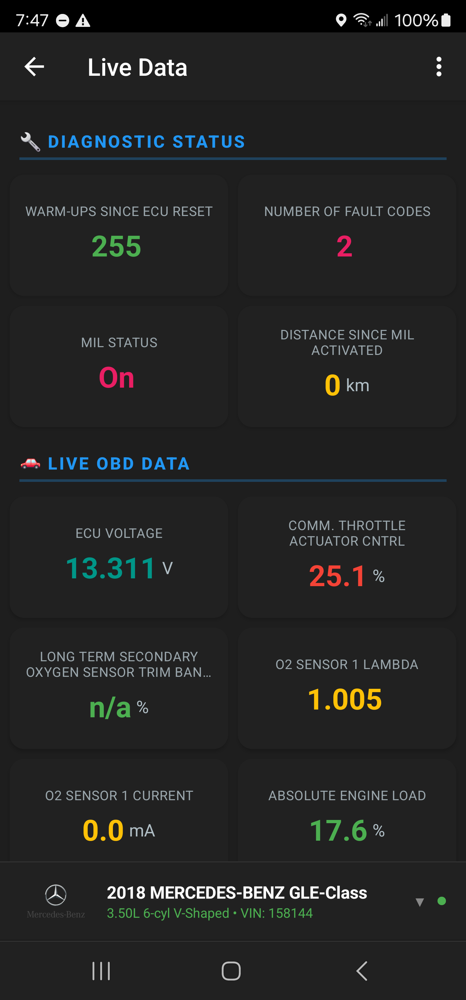
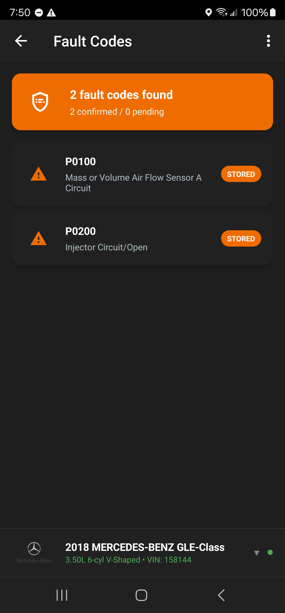

# OBD‑Droid

**Full-stack Android diagnostics suite for connected vehicles**

OBD‑Droid turns any ELM327-compatible adapter into a professional-grade diagnostic workstation. Built for technicians and enthusiasts, it combines real-time telemetry, deep ECU scanning, AutoCheck vehicle intelligence, and an AI copilot into one cohesive Android experience.

---

## ✨ Highlights

- **Live Telemetry Dashboard** with custom PID groups, charts, heads-up mode, CSV/GPS logging, and offline session caching.
- **Deep Diagnostics Pipeline** for full ECU discovery, freeze-frame capture, emissions readiness, and health scoring.
- **AI Copilot** that contextualizes DTCs, symptoms, and AutoCheck data using Anthropic Claude.
- **Dual Recall Intelligence** blending public NHTSA campaigns with VIN-specific open recalls from AutoCheck.
- **AutoCheck Vehicle History** (ownership, title, accident, odometer) delivered in-app with PDF export.
- **Modular Architecture**: service-driven data layer, feature-scoped packages, and standalone shared libraries.

> _“From connection handshake to AI-assisted troubleshooting, OBD‑Droid shows how far modern Android can stretch inside the garage.”_

---

## 📸 Product Tour

| Screen | Description |
| --- | --- |
|  | Live vehicle overview with quick actions, health summaries, and shortcut metrics. |
|  | Customizable PID lists, chart overlays, and logging controls. |
|  | Rich DTC cards with freeze frames, fix notes, and AI insights. |
|  | Full AutoCheck report viewer including open recalls and ownership timeline. |
|  | “All Recalls” (NHTSA) vs “Open Recalls” (AutoCheck) segmented view for portfolio-ready UX. |

> Screenshots live inside `docs/screenshots/`. Swap in your own captures before publishing the portfolio.

---

## 🧩 Feature Deep Dive

### Real-time Telemetry
- Adaptive polling with automatic protocol negotiation (ISO 9141-2, KWP2000, CAN).
- Multiple view modes (list, chart, dashboard, HUD) backed by shared `ProcessVariables`.
- CSV logger service stitches OBD values with GPS, accelerometer, and metadata for post-drive analysis.

### Diagnostics & Scanning
- Full-vehicle scan orchestrator maps ECUs, persistent DTCs, pending codes, and module metadata.
- Baseline scan library compares historic snapshots to spot new modules or faults.
- Emissions center mirrors inspection readiness (I/M monitors, catalyst status, O2 sensors).

### Intelligent Assistance
- **CoPilot** (Claude API) pulls context from active DTCs, vehicle metadata, and previous chats.
- Automatic suggested next steps and part lookup hints (based on failure patterns).
- Conversation threads cached per vehicle for continuity.

### Vehicle Intelligence
- VIN decode via `EnhancedVINDecoder` (NHTSA) with manufacturer and trim heuristics.
- AutoCheck API integration (companion Node service) for premium vehicle history:
  - Ownership chain, odometer verification, title brands, accident reports.
  - Open recall counts + detailed campaigns, exposed separately from NHTSA.
  - PDF export pipeline for shop handoffs.
- Hybrid recall center with segmented toggle:
  - **All Recalls** – NHTSA public campaigns and remedy data.
  - **Open Recalls** – AutoCheck VIN-specific, manufacturer actionable items.

---

## 🛠 Tech Stack

| Layer | Details |
| --- | --- |
| Language | Java 17 (Android), TypeScript/Node (AutoCheck companion) |
| UI | AppCompat + Material Components, RecyclerView, NestedScrollView, custom card system |
| Architecture | Service + manager pattern, feature-scoped packages, background workers |
| Data | SharedPreferences caching, on-disk CSV, JSON interop for AutoCheck reports |
| Integrations | NHTSA APIs, Experian AutoCheck (scraped via Playwright service), Anthropic Claude |
| Tooling | Gradle, Android Studio Giraffe+, Lint, unit tests, GitHub Actions (companion API) |

---

## 🧭 Project Map

```
OBD-Droid/
├── app/
│   ├── src/java/com/obddroid/
│   │   ├── features/
│   │   │   ├── copilot/           # AI assistant
│   │   │   ├── emissions/         # I/M readiness & compliance
│   │   │   ├── fueleconomy/       # MPG tracker
│   │   │   ├── recalls/           # NHTSA + AutoCheck open recalls
│   │   │   ├── vehiclehistory/    # AutoCheck reports & PDF export
│   │   │   └── common/            # Shared feature components
│   │   ├── obd/                   # Core OBD protocol stack
│   │   ├── scan/                  # ECU discovery & orchestration
│   │   ├── telemetry/             # CSV logging, GPS stitching
│   │   ├── services/              # Foreground/background Android services
│   │   ├── ui/activities/         # Primary screens
│   │   └── utils/                 # Helpers, VIN decoding, state managers
├── modules/
│   ├── dtc-database/              # Offline DTC catalog
│   ├── nhtsa-recall-lookup/       # Java/Kotlin bindings for NHTSA APIs
│   └── automotive-logo-library/   # OEM brand assets
├── docs/                          # Product notes, launch plans, screenshots
└── README.md
```

---

## 🚀 Getting Started

### Prerequisites
- Android Studio **Giraffe** (or newer) with **JDK 17**.
- Android SDK targets **API 21 – 34** (Android 5.0 – 14).
- Physical Android device (recommended) with Bluetooth OR USB host support.
- ELM327-compatible OBD-II adapter (Bluetooth Classic, BLE via Serial, USB, or Wi-Fi).

### Clone & Bootstrap

```bash
git clone https://github.com/Wal33D/OBD-Droid.git
cd OBD-Droid

# Pull bundled libraries (DTC database, logos, NHTSA bindings)
git submodule update --init --recursive

# Build & install debug variant
./gradlew :app:assembleDebug
./gradlew :app:installDebug

# Launch on device
adb shell am start -n com.obddroid/.ui.activities.MainActivity
```

> **Tip:** The AutoCheck vehicle history feature depends on the companion `autocheck-api` service. Bring it up locally (`npm install && npm run dev`) or point the app to the hosted instance.

---

## 🧪 Developer Workflow

| Task | Command |
| --- | --- |
| Clean build | `./gradlew clean` |
| Compile app sources | `./gradlew :app:compileDebugJavaWithJavac` |
| Unit tests | `./gradlew :app:testDebugUnitTest` |
| Lint & static analysis | `./gradlew :app:lintDebug` |
| Instrumentation tests | `./gradlew :app:connectedDebugAndroidTest` |
| Generate signed bundle | `./gradlew :app:bundleRelease` |

**Environment toggles**
- `gradle.properties` controls feature flags, logging verbosity, and Claude API settings.
- `app/build.gradle` encapsulates product flavors and dependency graph (no hard-coded secrets).

---

## 🔌 Key Integrations

| Integration | Purpose | Notes |
| --- | --- | --- |
| **AutoCheck API** | Premium vehicle history & open recall data | Companion Node/Playwright service scrapes authenticated reports, caches with Redis, serves REST. |
| **NHTSA Recall API** | Campaign listings, remedy info, VIN decodes | Base data source for “All Recalls” tab. |
| **Anthropic Claude** | Conversational diagnostics | Configured in CoPilot feature; redacts sensitive info before requests. |
| **Enhanced VIN Decoder** | Make/model/trim heuristics | Wraps NHTSA decode, normalizes model name variants to drive recall lookups. |

---

## 🧱 Architecture Notes

```
            ┌──────────┐
Adapter ⇨ CommService ⇨ ObdProt ⇨ ObdDataService ─┬─► Live Data / Gauges
            └──────────┘                           ├─► Fault Codes / Emissions
                                                  │   (freeze frames, readiness)
                                                  ├─► ScanOrchestrator → Baseline Library
                                                  ├─► CsvLoggingService (GPS + sensors)
                                                  └─► Feature Modules (CoPilot, Recalls, AutoCheck)

AutoCheck API ⇨ AutoCheckService ⇨ RecallActivity / AutoCheckActivity
NHTSA API     ⇨ RecallLookupAndroid ⇨ RecallActivity (All Recalls tab)
Claude API    ⇨ CoPilotService ⇨ CoPilotActivity (contextual AI answers)
```

- **Separation of Concerns**: OBD stack lives in its own package, while UI features orchestrate data via managers/services.
- **Request Queues & Caching**: AutoCheck companion caches VIN lookups; in-app caching reduces network load and supports offline revisit.
- **Configurable Telemetry**: Logging and AI features respond to user settings stored in `SharedPreferences`.

---

## 🧑‍💻 Contribution Guide

1. Follow existing Java style (Android Studio default with explicit braces).
2. Keep feature-specific logic under `features/<feature-name>`.
3. For new UI flows, create a `Coordinator` where shared interactions are needed.
4. Add unit tests for utility classes and managers; exercise critical flows manually with a connected adapter.
5. Run lint + unit tests before opening a PR.

---

## 🗺️ Roadmap

- [ ] Jetpack Compose migration for telemetry dashboards.
- [ ] BLE adapter improvements and auto-reconnect heuristics.
- [ ] Cloud sync for baseline scans and AutoCheck reports.
- [ ] In-app marketplace for pro data packs (TSBs, repair procedures).
- [x] Integrate AutoCheck open recalls alongside NHTSA campaigns.
- [x] Material-compliant segmented toggle for recalls UI.

---

## 📄 License & Attribution

This project is proprietary and maintained by **Waleed Judah**. Please reach out for collaboration or demo requests.

External services referenced:
- Experian AutoCheck (commercial license required).
- NHTSA APIs (public domain).
- Anthropic Claude (API key & usage agreement required).

---

## 💬 Let’s Connect

- Portfolio: _add link here_
- LinkedIn: _add link here_
- Email: _add contact here_

> Found this useful? ⭐ the repo, share it with your community, and let’s keep connected cars transparent.
Update the API endpoint in app settings or configuration.

---

## Troubleshooting

### Connection Issues
- Ensure Bluetooth/USB permissions are granted
- Check adapter is properly plugged into OBD-II port
- Verify vehicle ignition is on
- Try different protocol settings if auto-detect fails

### No Data Displayed
- Confirm vehicle supports OBD-II (1996+ for US vehicles)
- Check adapter compatibility
- Verify correct protocol is selected
- Try manual protocol selection

### Build Errors
- Ensure JDK 17+ is installed
- Update Android SDK to latest version
- Sync Gradle files
- Clean and rebuild project

---

## License

This project is private and proprietary. All rights reserved.

---

## Support

For issues, questions, or feature requests, please open an issue on GitHub or contact the development team.

---

**Current Version:** OBDroid v20616
**Last Updated:** October 2025
**Minimum Android:** 5.0 (API 21)
**Target Android:** 14 (API 34)
